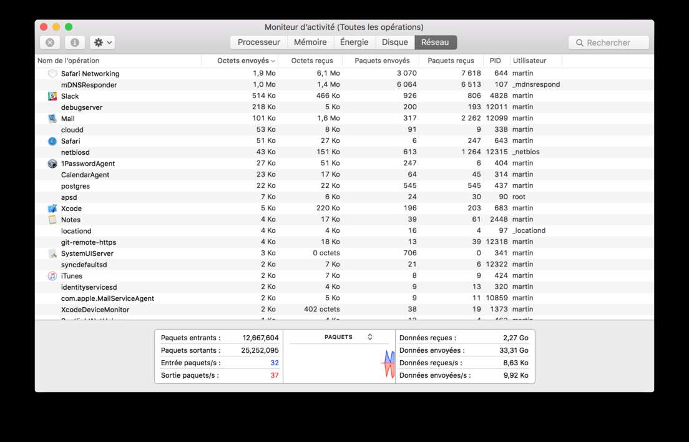

# lowdata

This repository is design to gather tools and technics to reduce bandwith consumption during a sailing trip with sattelite communication (9kB/min).

This guide is mainly dedicated to OSX, but is is designed to give cross-plateform advice in the future

## Measuring

Measuring is the first step before regulating. Use the tool you have to diagnostic network consumption, like *Monitor* on *OSX*:

## Email

You should forget *Gmail* and its fancy web interface: it was 100 times (check the good ration) the amount of data you need to exchange email. Go back to a simple desktop mail application with POP/SMTP configuration (IMAP send unnecessessary synchronisation message). Make sure to respect the following best practice:

- Use text only (not formatted) content.
- If you really want formatting, use Markdown
- No signature (your email address reveal already your identity)
- Remove previous content. If you want to quote, use ">"

Here are some desktop client you can use:
### Mail from OSX

This is my current configuration. I didn't manage to configure in text only yet: HELP WANTED!

### Thunderbird

TODO: Download and test

## Webrowsing

### Disable images, scripts, flash...

Start going in your browser preferences and disable images, scripts ...

### Opera Turbo

Opera offers an unique feature, the turbo mode: All pages are visited from opera's servers, compressed and then send to your computer. Privacy lovers, this is not for you
 
### Lynx browser

[Lynx](http://lynx.browser.org) is a text based web browser picture and javascript free that allow reducing the bandwith when browsing the web.

- [ ] Tutorial needed

## Avoid DNS request

In order to reduce DNS request, there is two option:

- Using IP instead of name server => unfortunately, it doesn't work if you try to access a website using virtualhost
- Add common domain name to `/etc/hosts`. When looking for a domain name resolution, the system first look into this file to avoid DNS request

## Limit unwanted connection

### Close all app

Most of your application exchange data with a server. Keep only the one you need.

### Disable unnecessary services

- [ ] TODO: List unnecessary services

## Collaboration

Forget Google Docs, Etherpad and other derivative: it's also a waste of data. Use Git and work locally. Here is a helpful ressource about it: https://try.github.com

Follow the best practices:

- Work locally by cloning repository: `git clone git@github.com:PoissonPilote/lowdata.git --depth 1`
- Use local issue (like issues.md)

## Reducing picture size

Sending picture is generally a bad idea when you have a 9ko/min bitrate. If you really need to, you should definitely reduce the size and choose the jpeg format (if you don't need transparency). [ImageMagick](https://www.imagemagick.org) is a simple command line tool dedicated to that.

### Installation

    brew install imagemagick

### Usage

    $ convert -quality 60 monitor.png  -resize 1104x monitor.jpg

Look at the size I spared for the above image:

    $ ls -l monitor.*
-rw-r--r--@ 1 martin  staff    70K 29 jul 13:50 monitor.jpg
-rw-r--r--@ 1 martin  staff   496K 29 jul 13:48 monitor.png
